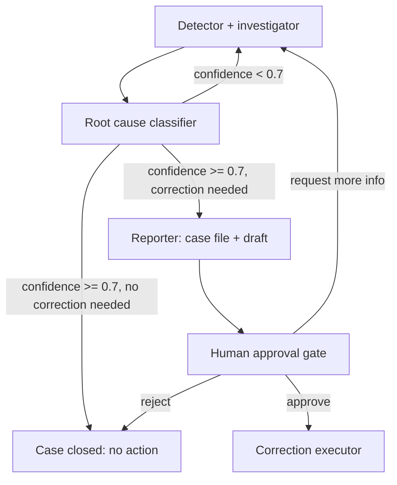

# Reconciliation Investigator

Built for the [Agents for Humans](https://agentsforhumans.devpost.com/) hackathon — Professional Agents track — on the [Strands Agents SDK](https://strandsagents.com/).

## The problem

Two systems that are supposed to agree — a legacy system and a modern
system — drift apart. Every night, discrepancies show up: a customer's
balance or status doesn't match between them. Someone has to export data,
compare records, dig through transaction history, reconstruct what
happened, determine the root cause, document it, and — only if a correction
is actually warranted — get it approved and applied.

**Reconciliation Investigator** does the investigation autonomously and
produces a complete, evidence-backed case file. It never applies a
correction on its own — that step is structurally impossible for any of its
reasoning agents, and requires explicit human approval.

## Architecture



Full system prompts, tool schemas, and the segregation-of-duties invariant
are specified in [`docs/build-contract.md`](docs/build-contract.md).

**Key design decision:** the tool that writes to the modern system
(`apply_correction`) is never registered on any LLM agent — it exists only
inside the deterministic `correction_executor` step, which runs after a
human has explicitly approved a specific correction. No agent in this
system can apply a correction even if it "decided" to; the write path
doesn't exist for it. This is enforced by tool registration, not by prompt
instruction — see section 4 of the build contract.

## Repo structure

```
reconciliation-investigator/
├── README.md
├── LICENSE
├── requirements.txt
├── docs/
│   └── build-contract.md        # system prompts, tool schemas, invariants
├── agents/
│   ├── detector_investigator.py
│   ├── classifier.py
│   └── reporter.py
├── orchestrator/
│   ├── graph.py                 # Strands Graph wiring, cycle + safety limits
│   ├── human_gate.py            # approval pause-point + token issuance
│   └── correction_executor.py   # the only caller of apply_correction
├── tools/
│   ├── legacy_system.py         # read_legacy_system
│   ├── modern_system.py         # read_modern_system, apply_correction
│   ├── transactions.py          # search_transactions, get_event_log
│   └── case_management.py       # draft_correction, create_case_ticket
├── data/
│   ├── seed_legacy.json
│   ├── seed_modern.json
│   └── seed_transactions.json   # 5 seeded discrepancy scenarios
├── ui/
│   └── approval_gate/           # minimal single-case approval screen
├── evals/
│   ├── cases.py                 # 5 Case definitions for strands-agents-evals
│   └── run_evals.py
└── deploy/
    └── agentcore.yaml
```

## Status

Under active development for the hackathon submission (deadline: Sep 14,
2026). Built with [Ares v2](https://github.com/) as the agentic build
engine, driven by GLM-5.3.

## Evals

Root-cause accuracy, tool selection/trajectory accuracy, and
safe-action compliance are measured with `strands-agents-evals` against 5
synthetic discrepancy scenarios. Results are published in
`evals/results.md` once the harness runs — no numbers are claimed here
until they're measured.

## License

[MIT](LICENSE)
