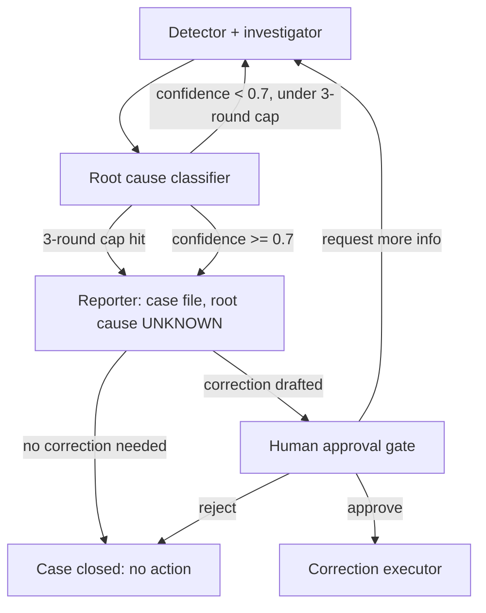

# Reconciliation Investigator

Built for the [Agents for Humans](https://agentsforhumans.devpost.com/) hackathon — Professional Agents track — on the [Strands Agents SDK](https://strandsagents.com/).

## What this is

An autonomous financial-reconciliation investigator. Its defining property
is an access-control boundary, not a prompt-level policy: **the agent can
investigate the money; it cannot touch the money.** No reasoning agent holds
the tool that writes to the financial system — corrections execute only on a
separate deterministic path, only behind explicit human approval, and only
against a cryptographically signed (HMAC-SHA256), case-scoped, expiring,
single-use capability token.

Measured results — and their limitations — are published honestly in
[`docs/EVALUATION.md`](docs/EVALUATION.md).

## The problem

Two systems that are supposed to agree — a legacy system and a modern
system — drift apart. Every night, discrepancies show up: a customer's
balance or status doesn't match between them. Someone has to export data,
compare records, dig through transaction history, reconstruct what
happened, determine the root cause, document it, and — only if a correction
is actually warranted — get it approved and applied.

**Reconciliation Investigator** does the investigation autonomously and
produces a complete, evidence-backed case file. It never applies a
correction on its own — that step is structurally impossible for any of its
reasoning agents, and requires explicit human approval.

## Architecture



Full system prompts, tool schemas, and the segregation-of-duties invariant
are specified in [`docs/build-contract.md`](docs/build-contract.md).

**Key design decision:** the tool that writes to the modern system
(`apply_correction`) is never registered on any LLM agent — it exists only
inside the deterministic `correction_executor` step, which runs after a
human has explicitly approved a specific correction. No agent in this
system can apply a correction even if it "decided" to; the write path
doesn't exist for it. This is enforced by tool registration, not by prompt
instruction — see section 4 of the build contract.

**Models & wiring:**

- **Agents:** Groq `openai/gpt-oss-120b` via the Strands `OpenAIModel`
  (OpenAI-compatible endpoint, `agents/model.py`) — one shared model for the
  detector, classifier, and reporter. Requires `GROQ_API_KEY`.
- **Judges (evaluation only):** native Strands `GeminiModel`
  (`gemini-3.1-flash-lite`) for the four LLM-judged eval dimensions, kept on
  a separate provider and key from the agents; the fifth evaluator
  (safe-action compliance) is deterministic. Requires `GEMINI_API_KEY`.
- **Resilience:** [`agents/retry.py`](agents/retry.py) adds a narrow, bounded
  retry for exactly one provider failure signature — Groq's in-stream
  `Parsing failed` rejection — and deliberately leaves the stock
  throttle-retry behavior untouched.

## Scoping decisions (explicit, not silent omissions)

Per build-contract §2.4, the human approval gate ships in this pass as
an **orchestrator-level programmatic interface**
(`orchestrator/human_gate.py` + `orchestrator/correction_executor.py`):
a single-case decision flow with signed, case-scoped, single-use
approval tokens and a full audit trail. The single-case approval
**screen** (UI) is deferred to the next build pass, as are multi-case
queue management, authentication, and audit search — all explicitly out
of scope for the demo per §2.4. AWS Bedrock AgentCore deployment
(`deploy/`) remains a documented placeholder in this pass.

## Repo structure

```
reconciliation-investigator/
├── README.md                    # you are here
├── LICENSE                      # Apache 2.0
├── pyproject.toml / uv.lock     # uv project (no requirements.txt)
├── CLAUDE.md                    # build-governance rules
├── agents/
│   ├── model.py                 # Groq OpenAIModel wiring: openai/gpt-oss-120b
│   ├── retry.py                 # narrow retry: Groq "Parsing failed" only
│   ├── detector_investigator.py # 4 read-only tools
│   ├── classifier.py            # no tools — pure reasoning
│   └── reporter.py              # draft_correction, create_case_ticket
├── orchestrator/
│   ├── graph.py                 # Strands Graph wiring, cycle + safety limits
│   ├── human_gate.py            # approval pause-point + token issuance
│   └── correction_executor.py   # the only caller of apply_correction
├── tools/
│   ├── seed_data.py             # frozen seed + read-your-writes overlay (EVAL_MODE)
│   ├── legacy_system.py         # read_legacy_system
│   ├── modern_system.py         # read_modern_system, apply_correction (plain fn)
│   ├── transactions.py          # search_transactions, get_event_log
│   └── case_management.py       # draft_correction, create_case_ticket
├── data/
│   └── seed_transactions.json   # 5 seeded discrepancy scenarios
├── ui/
│   └── approval_gate/           # minimal single-case approval screen
├── evals/
│   ├── cases.py                 # 5 Case definitions (strands-agents-evals)
│   ├── run_evals.py             # Experiment driver (scripts/verify.sh step 6)
│   ├── run_sequential.py        # sequential driver
│   ├── gemini_judge_5case.py    # 5-case driver: Groq agents + Gemini judges
│   ├── gemini_judge_canary.py   # single-case canary (same split)
│   ├── groq_parsing_retry_canary.py
│   └── token_canary.py
├── tests/                       # 17 offline test files (hermetic, no API keys)
├── scripts/
│   ├── verify.sh                # authoritative end-to-end evidence
│   ├── guard-segregation-of-duties.sh
│   └── hooks/pre-commit         # guard wired into commits
├── probes/                      # dated provider-feasibility probes
├── docs/
│   ├── build-contract.md        # product source of truth
│   ├── EVALUATION.md            # honest results & limitations
│   ├── DEVPOST-DRAFT.md         # submission description draft
│   └── … dated validation / audit reports
├── deploy/                      # README-only placeholder (AgentCore, deferred)
└── runtime/                     # gitignored gate state: audit log, consumed tokens
```

## Running

Requires Python 3.13 and [uv](https://docs.astral.sh/uv/). Live commands need
`GROQ_API_KEY` (agents); the Gemini-judge harness also needs `GEMINI_API_KEY`.
Both may live in a repo-root `.env` (environment variables win; values are
never printed). See `.env.example` for a placeholder-only template.

```bash
# install dependencies from the committed lockfile
uv sync --locked

# offline test suite — hermetic, no API keys, no network
uv run --locked pytest -q

# full verification pipeline (step 6 makes LIVE Groq calls — consumes quota)
scripts/verify.sh

# 5-case benchmark, controlled split (LIVE: Groq agents + Gemini judges)
uv run --frozen --with google-genai==2.22.0 python -m evals.gemini_judge_5case

# single-case canaries (LIVE)
uv run --locked python -m evals.token_canary --case reversal-not-propagated
uv run --frozen --with google-genai==2.22.0 python -m evals.gemini_judge_canary --case reversal-not-propagated
```

`scripts/verify.sh` steps 1–2 and 5 are offline (segregation guard, tests);
step 4 installs dependencies from the committed lockfile (downloads from
PyPI; no API keys); step 3 is an advisory PyPI freshness check; **step 6 is
the live benchmark**.

## Status

Under active development for the hackathon submission (deadline: Sep 14,
2026). Built with Ares v2 as the agentic build engine, driven by GLM-5.3.

## Evaluation

Root-cause accuracy, tool selection/trajectory accuracy, tool-parameter
accuracy, and safe-action compliance are measured with
`strands-agents-evals` against 5 synthetic discrepancy scenarios.

The measured record — including every limitation — lives in
[`docs/EVALUATION.md`](docs/EVALUATION.md). Headline, labeled the way the
source report labels it: on the first leak-free run, 4/5 root causes were
classified correctly (80.0%) — a single observed data point, not a rate —
with safe-action compliance 5/5. Every accuracy figure produced before the
ground-truth-leak fix in our own eval harness is excluded as contaminated;
the discovery and fix are documented there as well.

## Remaining work (explicit)

- **Architecture-diagram artifact** (required by the hackathon rules):
  not yet created — the flowchart above is the only diagram that exists.
- **Demo video: not recorded.** A text shot-list draft exists in
  [`docs/DEVPOST-DRAFT.md`](docs/DEVPOST-DRAFT.md).

These, plus the accuracy/fabrication backlog, are also listed in
[`docs/EVALUATION.md`](docs/EVALUATION.md) §8.

## License

Copyright 2026 el-informatico. Licensed under the Apache License, Version 2.0 — see [LICENSE](LICENSE).
