# Architecture diagram — submission artifact (2026-09-06)

The hackathon rules (agentsforhumans.devpost.com) require an architecture
diagram. This document is the canonical home of that diagram: the Mermaid
source below is the single source of truth, the identical block is embedded
in `README.md` (kept byte-identical by
`tests/test_architecture_diagram_sync.py`), and rendered exports live
alongside this file as `docs/architecture-diagram.svg` and
`docs/architecture-diagram.png`.

The diagram describes the system as implemented at commit `0699249`
(2026-09-06): the three-agent investigation graph, the human approval gate
with its capability-token mechanism, and the deterministic execution path.
Every zone maps to code; see the accuracy map below.

## The diagram

```mermaid
flowchart TB
    subgraph AG["AGENT GRAPH — LLM agents (Groq openai/gpt-oss-120b)<br/>capability: read + draft only — no mutation tool exists on this side"]
        direction LR
        DET["Detector-investigator agent<br/>tool access: READ-ONLY<br/>read_legacy_system · read_modern_system<br/>search_transactions · get_event_log"]
        CLS["Classifier agent<br/>tool access: NONE<br/>pure reasoning over the evidence"]
        REP["Reporter agent<br/>tool access: DRAFT-ONLY<br/>draft_correction · create_case_ticket"]
        STORES["runtime case stores<br/>drafts.jsonl · tickets.jsonl<br/>(+ rejected_calls.jsonl diagnostics)"]
        CLOSED_NC["CASE CLOSED — no action<br/>ticket filed, no draft created"]
        DET --> CLS
        CLS -->|"confidence < 0.7 and rounds < 3"| DET
        CLS -->|"confidence >= 0.7 OR 3-round cap:<br/>force-route (root cause surfaced as<br/>UNKNOWN after the graph, not in it)"| REP
        DET -->|"evidence bundle, every run"| REP
        REP -->|"draft (if warranted) + ticket (always)"| STORES
        REP -->|"no correction warranted"| CLOSED_NC
    end

    subgraph HG["HUMAN GATE — deterministic orchestrator step + human operator<br/>(outside the agent graph)"]
        direction LR
        SURF["Approval surface — renders the case,<br/>holds no authority of its own:<br/>approval.cli terminal · approval.web loopback-only"]
        HUM["HUMAN APPROVER<br/>reviews case + proposed correction:<br/>APPROVE / REJECT / REQUEST MORE INFO"]
        GATE["Human gate<br/>orchestrator/human_gate.py<br/>(deterministic Python)"]
        TOK["Capability token, issued on APPROVE:<br/>HMAC-SHA256 signed · case-scoped<br/>(one field + one value) · 10-minute TTL<br/>· single-use (jti)"]
        CLOSED_REJ["CASE CLOSED —<br/>tickets rejected + human reason"]
        SURF --> HUM
        HUM --> GATE
        GATE -->|"APPROVE"| TOK
        GATE -->|"REJECT"| CLOSED_REJ
    end

    subgraph EX["EXECUTION — deterministic code, the sole mutation path"]
        direction LR
        VALID["Token validation at executor entry:<br/>signature · expiry · case/field/value scope<br/>· single-use (consumed_tokens.jsonl)"]
        EXEC["Correction executor<br/>the ONLY caller of apply_correction"]
        APPLY["apply_correction<br/>the system's only financial write<br/>(the modern-system record)"]
        AUD["Audit trail — every gate and<br/>executor event: runtime/audit_log.jsonl"]
        VALID -->|"valid"| EXEC
        EXEC --> APPLY
        EXEC -->|"correction_applied"| AUD
        VALID -.->|"replay / expired / out-of-scope:<br/>rejected + logged correction_failed,<br/>terminal statuses never downgraded"| AUD
    end

    subgraph EV["OFFLINE EVAL HARNESS — not part of the runtime path"]
        JUDGE["Gemini judges (gemini-3.1-flash-lite)<br/>4 LLM-judged dimensions +<br/>deterministic safe-action check"]
    end

    AG -->|"pending draft + open ticket"| HG
    HG -->|"one-time capability token"| EX
    HG -.->|"request more info: fresh investigation<br/>(bounded, 5 human rounds)"| AG

    NOTE["NO PATH EXISTS from any LLM agent<br/>to apply_correction: it is never registered<br/>in any agent's tools list — enforced by tool<br/>registration (sole caller: correction_executor,<br/>behind the human gate); the grep guard<br/>scripts/guard-segregation-of-duties.sh adds a<br/>weaker same-line tripwire (verify.sh step 2 +<br/>git pre-commit)"]
    NOTE ~~~ EX

    classDef ag fill:#E8F0FE,stroke:#1A73E8,color:#202124
    classDef human fill:#FEF7E0,stroke:#F9AB00,color:#202124
    classDef gate fill:#EEF1F6,stroke:#5F6B7C,color:#202124
    classDef token fill:#E6F4EA,stroke:#137333,color:#202124
    classDef mut fill:#FCE8E6,stroke:#D93025,color:#202124
    classDef store fill:#F1F3F4,stroke:#9AA0A6,color:#202124
    classDef note fill:#FFFFFF,stroke:#D93025,color:#D93025,stroke-dasharray:5 4
    class DET,CLS,REP ag
    class SURF,HUM human
    class GATE gate
    class TOK token
    class VALID,EXEC,APPLY mut
    class STORES,AUD,CLOSED_NC,CLOSED_REJ,JUDGE store
    class NOTE note
```



## Rendering it yourself (about one minute)

- **No install:** open <https://mermaid.live>, paste the block above
  (without the ` ```mermaid ` fence), use *Actions → PNG/SVG* to export.
- **GitHub:** any `.md` file containing this fenced block renders it
  natively — `README.md` does.
- **VS Code:** the "Markdown Preview Mermaid Support" extension renders
  the fenced block in the built-in preview.

The committed exports (`docs/architecture-diagram.svg`,
`docs/architecture-diagram.png`) were rendered from exactly this source
with Mermaid 11.17.2 (`securityLevel: strict`, default theme); see the
provenance section below.

## Accuracy map (diagram element → code)

| Diagram element | Code anchor |
|---|---|
| Agent graph nodes and edges | `orchestrator/graph.py:244-247` (four edges, including the detector→reporter evidence mirror), composed by `run_case_with_gate` (`orchestrator/graph.py:313`) |
| Detector tool access (4 read-only tools) | `agents/detector_investigator.py:44-57` |
| Classifier no-tools | `agents/classifier.py:37-45` (`tools=None`) |
| Reporter draft-only tools | `agents/reporter.py:34-42`; `tools/case_management.py:218` (`draft_correction`), `:288` (`create_case_ticket`) |
| Confidence cycle and 3-round force-route cap | `orchestrator/graph.py:152-163` (`CONFIDENCE_THRESHOLD = 0.7`, `MAX_INVESTIGATION_ROUNDS = 3`), `:185-194` |
| UNKNOWN normalization after the graph | `orchestrator/graph.py:261-280` (`verdict_from_result`; the in-graph reporter input carries the raw classifier output) |
| Reporter always files a ticket; drafts only if warranted | `agents/reporter.py:23-24`; no-correction terminal = no pending draft |
| Approval surfaces (no authority) | `approval/cli.py`, `approval/web.py` (loopback-only bind, `approval/web.py:48-52`) |
| Capability token (HMAC-SHA256, case/field/value scope, 10-minute TTL, single-use jti) | `orchestrator/human_gate.py:70-87` (issue), `:30` (`DEFAULT_TTL_SECONDS = 600`), `:90-138` (validate, single-use via `runtime/consumed_tokens.jsonl`) |
| Token validation at executor entry | `orchestrator/correction_executor.py:73-77` |
| Executor as the only caller of apply_correction | `orchestrator/correction_executor.py` (sole non-test import of `tools/modern_system.py:45`); the single APPROVE→execute composition is `apply_gate_approval` (`orchestrator/graph.py:291-310`) |
| Audit trail and replay/expiry rejection | `runtime/audit_log.jsonl` via `orchestrator/human_gate.py:141-146` and `orchestrator/correction_executor.py:48-70` (terminal statuses never downgraded) |
| REJECT terminal (tickets rejected + reason) | `orchestrator/human_gate.py:262-281` |
| REQUEST_MORE_INFO as a bounded re-invocation | `orchestrator/graph.py:288` (`MAX_HUMAN_ROUNDS = 5`), `:352-358` (note re-enters as `investigation_hint`) |
| Groq runtime provider | `agents/model.py:29-31` (`openai/gpt-oss-120b` over the Groq OpenAI-compatible endpoint) |
| Gemini eval-only judges | `evals/gemini_judge_canary.py:62-63` (`gemini-3.1-flash-lite`); no Gemini code in `agents/`, `orchestrator/`, `tools/`, `approval/` |
| No-LLM-path note (structural enforcement + guard tripwire) | Primary: tool registration — `apply_correction` is a plain function (`tools/modern_system.py:45`), never in any `Agent(...)` tools list (`agents/detector_investigator.py:48-53`, `agents/classifier.py:41`, `agents/reporter.py:38`); sole non-test caller `orchestrator/correction_executor.py:20`, behind the human gate; pinned by `tests/test_agents.py:45-64`, `tests/test_tools.py:166-171`, `evals/cases.py:161-167`. Weakest additional layer: `scripts/guard-segregation-of-duties.sh` (verify.sh step 2 + `scripts/hooks/pre-commit`) — same-line grep tripwire, not containment |

## Design notes

- **Zone-level edges for readability.** The three cross-zone edges attach
  at zone granularity; anchoring them to inner nodes would force Mermaid
  to collapse each zone's internal layout. The edge labels carry the
  node-level semantics ("pending draft + open ticket", "one-time
  capability token").
- **Two distinct terminals.** "Case closed — no action" (no draft was ever
  created) and "Case closed — tickets rejected" (human REJECT with reason)
  are separate stores states and are drawn separately.
- **Deliberate omissions** (kept in prose/README instead, for diagram
  readability): the narrow Groq "Parsing failed" retry wrapper
  (`agents/retry.py`), the in-memory web-session state, the §2.4
  demo-scope items (approver auth, multi-case queue, audit search), and
  the AgentCore deployment placeholder (`deploy/`). The runtime stores
  `overrides.json` (what `apply_correction` writes in eval mode) is
  summarized as "the modern-system record" on the apply node.
- **Correction of the prior README diagram.** The block this replaces
  omitted the detector→reporter evidence edge, drew UNKNOWN as reporter
  input (it is a post-graph normalization), drew "request more info" as a
  simple back-edge (it is a bounded full re-invocation), and conflated the
  two terminal states. It also showed none of: approval surfaces,
  capability token, token validation/replay rejection, audit trail,
  per-agent tool access, model providers.

## Provenance and verification

- Mermaid source validated and rendered offline with Mermaid 11.17.2
  (`securityLevel: strict`, default theme, `flowchart.useMaxWidth: false`)
  via a headless Chromium engine; GitHub's renderer is on the same major
  version family. `PARSE_OK` on the exact source above; natural size
  3230×1010 px; PNG exported at 2× device scale.
- Exports: `docs/architecture-diagram.svg` (vector, ~46 KB) and
  `docs/architecture-diagram.png` (6508×2068 px — the 3230×1010 diagram at
  2× scale plus the page's 12 px-per-side padding; ~650 KB). For the
  Devpost upload, prefer the PNG (image-upload forms accept PNG directly);
  the SVG scales losslessly for print/slides.
- `tests/test_architecture_diagram_sync.py` pins the README block and this
  block byte-identical.
- Classification of this document's own claims: code anchors are
  OBSERVED (read from the working tree at `0699249`); render facts are
  MEASURED (tool output recorded above); GitHub-version-family is
  DOCUMENTED (GitHub public docs), not measured here.
